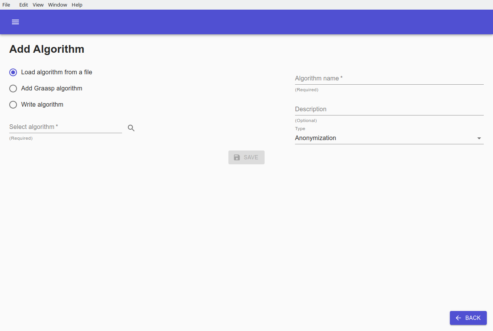
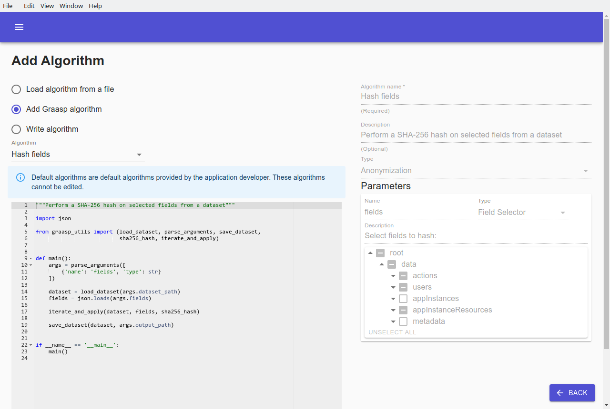
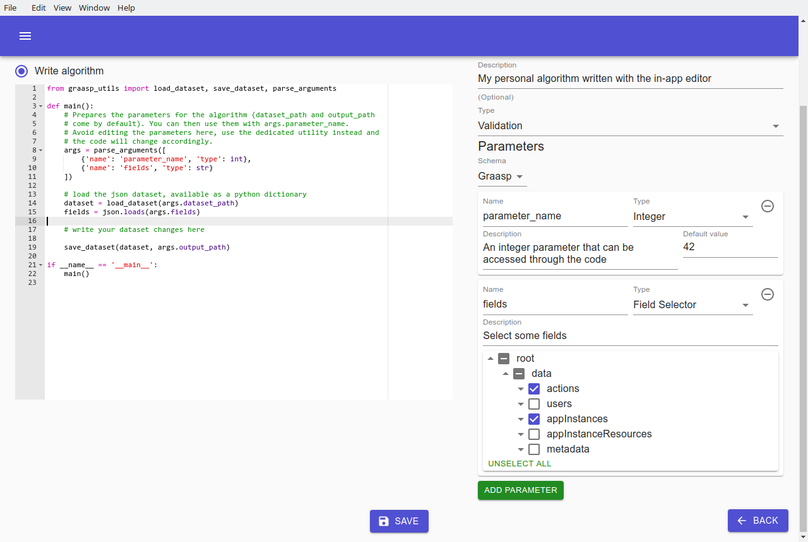
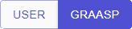
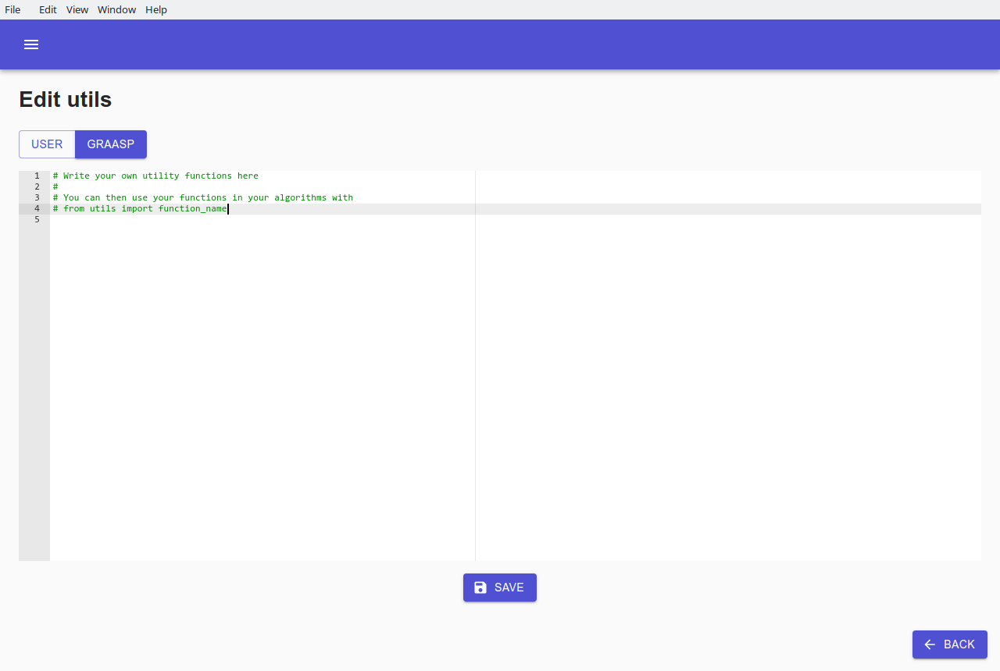
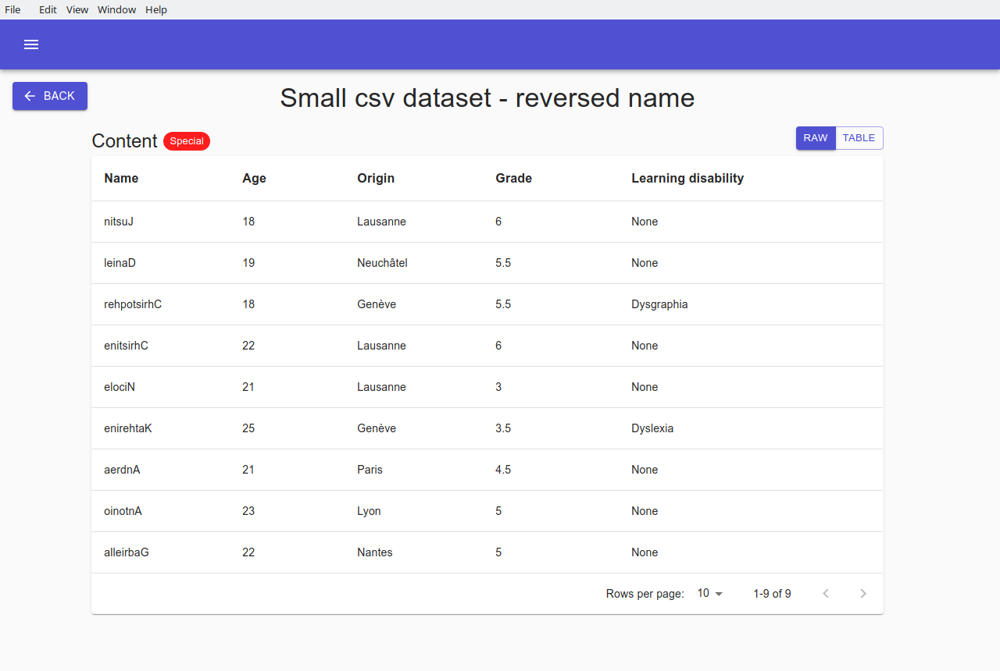

# Algorithms

The `Algorithms` tab contains every algorithm that can be used throughout Graasp Insights. It is also the entry point for accessing, editing and writing algorithms.

Graasp Insights uses two different types of algorithm: `Anonymization` and `Validation`. Anonymization algorithms are used in the `Executions` tab and result in a new. modified dataset. Validation algorithms are used to validate whether a dataset is anonymized in the `Validation` tab and usually return a boolean value. 

If you loaded the provided Graasp data, your `Algorithms` should already contain algorithms.

Algorithms in Graasp Insights are written in the Python programming language.


## Adding an algorithm

From the `Algorithms` tab, add a new algorithm with the lower right plus button . A new screen titled `Add Algorithm` shows up with three alternatives to add a new algorithm.

### 1. Load algorithm from a file

Add an algorithm from your file system. Although any `Python` algorithm can be added, dataset loading and saving as well as parameter handling is done in a specific way. It is therefore recommended to review existing existing algorithms to have a better understanding of how the algorithm should communicate with the interface. The `Write algorithm` option is also a good alternative to quickly learn about what the algorithm layout should look like.



### 2. Add a Graasp algorithm

Select a pre-made Graasp algorithm to add to the application. This allows to add Graasp algorithms individually to Graasp Insights. You cannot edit pre-made algorithm.



### 3. Write an algorithm

An in-app editor is available for you to write your algorithms. The editor is filled with pre-written code taking care of handling parameters as well as loading and saving the dataset. Write your code in the designated `write your dataset changes here` area.


Give the algorithm a name and a description so that you can refer to it later when executing algorithms.

Both `anonymization` and `validation` algorithms can be written. Switching between the two can be done with the `Type` menu select. 

Click on the `SAVE` button  when you are done writing your algorithm. The algorithm will then be available in the [Executions](executions.md) or [Validation](validation.md) tab.

### Add parameters

When adding an algorithm with the `Write algorithm` option, a new parameter can be added by clicking on the `ADD PARAMETER` button .

Choose a type and enter a name, a description and a default value for your new parameter. As you modify the parameters, the code is automatically updated to accommodate for the new parameters. You can then access your parameter with `args.parameter_name`.



Four types are available for you to choose:

- `Integer`: a number which is not a fraction; a whole number (eg: `1`, `32`)
- `Float`: a Floating point number (eg: `0.3`, `420.3`)
- `String`: a sequence of characters
- `Field Selector`: The `Field Selector` consists of a nested attribute selection. The user can select attributes of a dataset and that selection can be accessed within the algorithm code. The `Field Selector` is particularly useful for executing algorithms on specific parts of a dataset. The attributes that are shown depend entirely on the schema. If there is more than one schema loaded in Graasp Insights, you can switch between schemas with the schema selection that shows up at the top of the `Parameters` section. Use the following code to load a field selection named `fields`:

```python
import json

fields = json.loads(args.fields)
```

> Note: if no schema corresponds to the dataset you want to apply the algorithm on, you can generate one for your dataset in the [Schemas](schemas.md) tab.

> Note: Parameters cannot be empty and parameter names must be unique. Otherwise the algorithm cannot be saved.

## Edit algorithm

Each algorithm can be viewed and edited with the `Edit Algorithm` button .


An editor shows up on the left for you to modify the code of the algorithm. Additionally, you can modify the name, description, type and parameters on the right.

For more information about how to write an algorithm within Graasp Insights, jump to the [Adding an algorithm](#Adding-an-algorithm) section.

When you have finished editing the algorithm click on the `Save` button  to save your modifications. Alternatively, click on the `Back`  button to discard your changes and go back to the `Algorithms` screen.

> Note: Graasp algorithms are not editable. Attempting to edit one will create a new algorithm instead


## Utils files

Utils files, short for 'utility files', contain general purpose scripts that can be used across multiple algorithms.

Access the utils files by clicking on `EDIT UTILS`  in the `Algorithms` tab.

Two types of utils files are available and you can switch between the two with the `USER|GRAASP` buttons .

The `USER` utils file is reserved for the user to write their own custom functions. The user can then import their custom function called for example `function_name` with:

```python
from utils import function_name
```
Edit User utils             |  Edit Graasp utils
:-------------------------:|:-------------------------:
  |  

The `GRAASP` utils file contains functions that are used in Graasp algorithms and that might be useful for user algorithms. You can import them with:

```python
from graasp_utils import graasp_function_name
```

A brief description of functions that might be useful:

- `load_dataset(dataset_path)`
  > Load a json dataset located at `dataset_path` into a Python dictionary
- `save_dataset(dataset, dest_path)`:
  > Save a Python dictionary `dataset` at `dest_path`
- `parse_arguments(additional_arguments)`:
  > Parses the arguments/parameters that are given as input to the algorithm.
- `iterate_and_apply(dataset, field_selection, func)`:
  > Iterate over a `dataset` using a `field_selection` and apply an arbitrary function `func` on the selected fields.
- `notify_validation_result(outcome, info)`:

  > Notify Graasp Insights of the outcome of a validation algorithm. `outcome` should be one of `ValidationOutcome.SUCCESS`, `ValidationOutcome.WARNING` or `ValidationOutcome.FAILURE`.  
  > Decide the text that is displayed when hovering the status icon with the `info` parameter.

The following example showcases the use of `iterate_and_apply` to easily apply a function over selected fields:


Executing that algorithm on some simple dataset with the field `Name` selected effectively reverses it:


