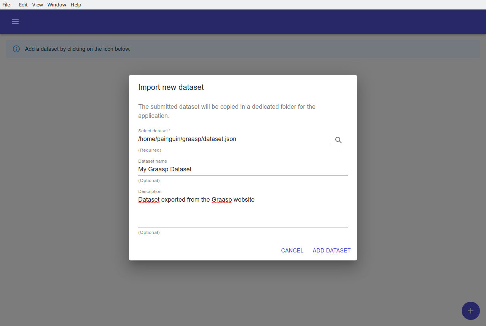
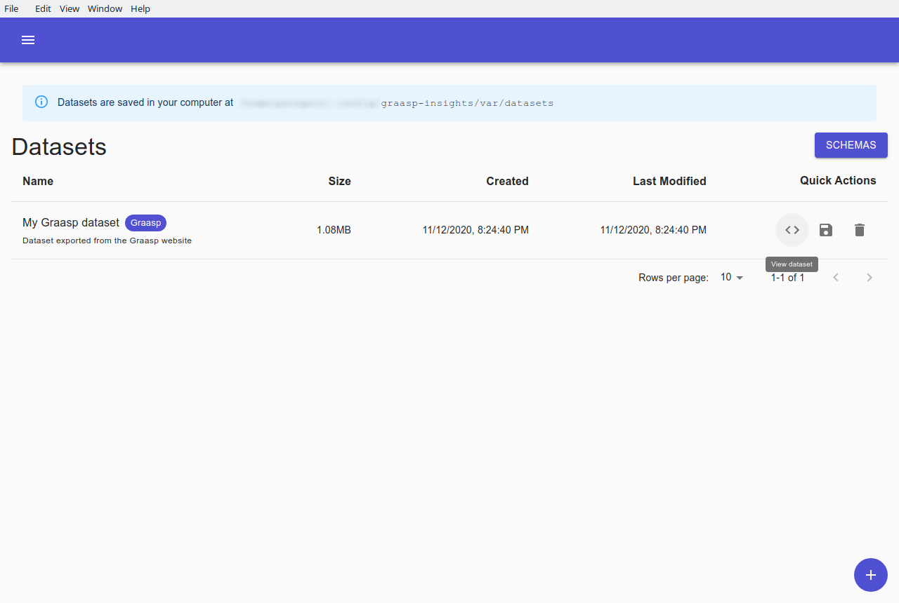
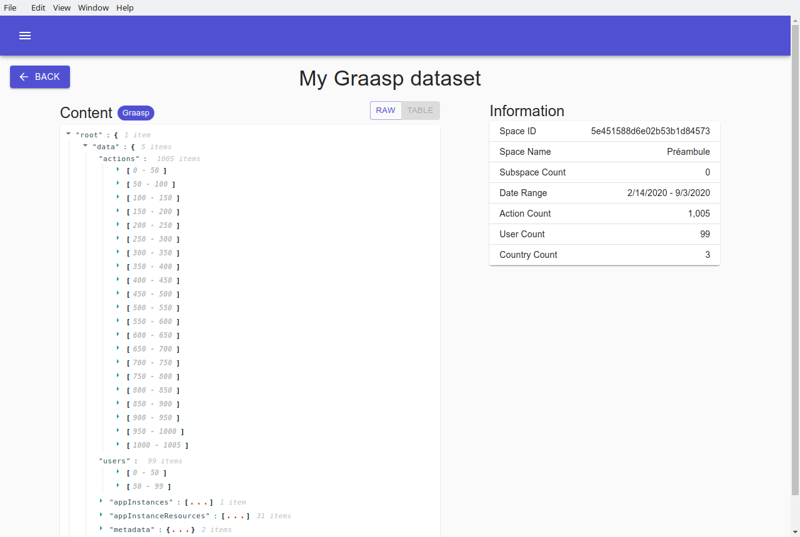
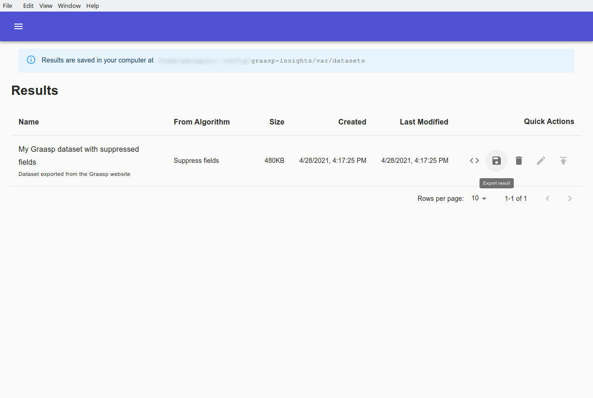

# Datasets

## Importing a dataset

Load a dataset into Graasp Insights by using the plus button  on the lower right .

Choose a dataset to import by navigating to its location in your file system.
You can optionally give it a name and description for its use in Graasp Insights.

Importing a dataset will create a copy of the file and manipulating it through Graasp Insights will have no impact on the original file.
`json`, `csv` and `xlsx` datasets are supported in the current state.

If the dataset conforms to an existing schema, it will be tagged with that schema. For more about Schemas see the [Schemas](schemas.md) section.

## Dataset management

Once loaded, general information about the dataset is displayed. You can:

- **View a dataset**: Clicking on this button will navigate you to a view where the content of the dataset is displayed. More details below.
- **Export a dataset**: Exporting a dataset allows you to copy the chosen dataset somewhere else on your machine. This allows you to keep a safe copy of this dataset you only can erase.
- **Delete a dataset**: Deleting a dataset will remove it from the application and your machine. This does not remove related information such as executions, etc.

Click on the `View dataset` button  to inspect the content of the dataset.
If the dataset follows the `Graasp` schema, additional information about the content is also displayed.

Navigate through the data and edit any particular value with the `RAW` view.

If the dataset was loaded as a `csv` or `xlsx` file, or if the structure of the dataset supports it, you can switch to a `TABLE` view to display a tabular version of it.

# Results

The `Results` tab displays the datasets resulting from executing algorithms. Their content might differ from their original dataset.

Similar to the `Datasets` tab, various information about a result is displayed and its content can be inspected with the `View result` icon.

After having certified that the dataset was properly anonymized using the [Validations](validations.md) screen, you can export it into your file system by clicking on the `Export result` icon (floppy disk).
