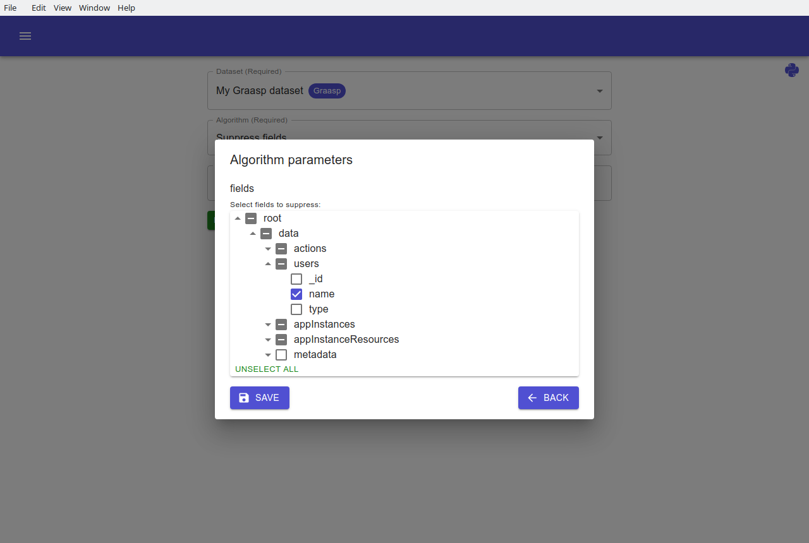
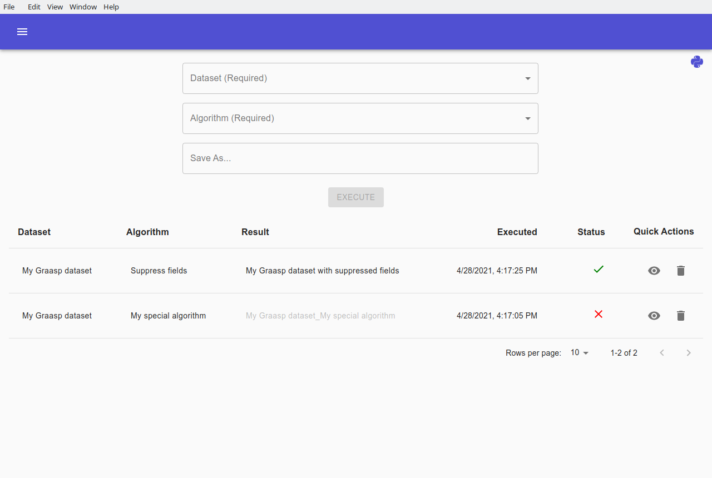

# Executions

Use the `Executions` tab to execute algorithms on datasets.

Before proceeding, make sure a Python installation is present and recognized by the client. Check the version of your Python installation by hovering on the top right Python logo. The logo turns gray if no Python installation is found.

Select a dataset, the algorithm you want to apply, and (optionally) a name for the resulting dataset.

If the algorithm has parameters, then a green `EDIT PARAMETERS` button  should appear for you to edit them.

> Note: If there is a field selection (as in the example above) and the schema doesn't correspond to the dataset, you can generate a new schema for your dataset in the `Schemas` tab.

Finally, start the execution by clicking on the `EXECUTE` button .

The status of your new execution can then be tracked with the table underneath. A green "check" icon will indicate that the execution has finished and was successful. A red cross will indicate that an error has happened.

You can click on the dataset, algorithm, or result buttons to access the corresponding data

The dropdown for dataset selection in this Executions tab will also include the resulting datasets. This allows you to chain and apply multiple algorithms to a dataset.

Click on the `View execution` icon to see more information about the execution. From there, the used parameters and the output log are also displayed. The output log is particularly useful for debugging your algorithm if an error happened.

