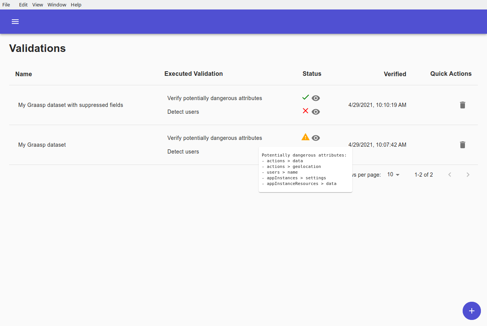

# Datasets

## Menu navigation

When opening Graasp-Insights, you are greeted with the `Datasets` tab.
Use the top-left menu button to navigate to each distinctive tab.


## Importing a dataset

Load a dataset into Graasp Insights by using the lower right `+` button.

Choose a dataset to import by navigating to its location in your file system.
You can optionally give it a name and description for its use in Graasp Insights.


Importing a dataset will create a copy of the file and manipulating it through Graasp Insights will have no impact on the original file.
Only `json`, `csv` and `xlsx` datasets are supported in the current state.

## Dataset management

Once loaded, general information about the dataset is displayed. It can additionally be viewed, exported and deleted using the quick actions.


Click on the `View dataset` button to inspect the content of the dataset.
If the dataset follows the `Graasp` schema, additional information about the content is also displayed.

Navigate through the data and edit any particular value with the `RAW` view.


If the dataset was loaded as a `csv` or `xlsx` file, or if the structure of the dataset supports it, you can switch to a `TABLE` view to display a tabular version of it.


# Algorithms

The `Algorithms` tab contains every algorithm that can be used throughout Graasp Insights. It is also the entry point for accessing, editing and writing algorithms.


## Edit algorithm

Each algorithm can be viewed and edited with the `Edit Algorithm` button.


An editor shows up on the left for you to modify the code of the algorithm. Additionally, you can modify the name, description, type and parameters on the right.

For more information about how to write an algorithm within Graasp Insights, jump to the [Adding an algorithm](#Adding-an-algorithm) section.

When you have finished editing the algorithm click on the `Save` button to save your modifications. Alternatively, click on the `Back` button to discard your changes and go back to the `Algorithms` screen.

# Executions

Use the `Executions` tab to execute algorithms on datasets.

Select a dataset, the algorithm you want to apply, and (optionally) a name for the resulting dataset.


If the algorithm has parameters, then a green `EDIT PARAMETERS` button should appear for you to edit them.


> Note: If there is a field selection (as in the example above) and the schema doesn't correspond to the dataset, you can generate a new schema for your dataset in the `Schemas` tab.

Finally, start the execution by clicking on the `EXECUTE` button.

The status of your new execution can then be tracked with the table underneath. A green "check" icon will indicate that the execution has finished and was successful. A red cross will indicate that an error has happened.


The Dataset select menu also includes the resulting datasets. This allows you to chain and apply multiple algorithms to a dataset.

> Note: you can also check the version of your python installation by hovering on the top right python logo. The logo turns gray if no python installation is found.

Click on the `View execution` icon to see more information about the execution. From there, the used parameters and the output log are also displayed. The output log is particularly useful for debugging your algorithm if an error happened.


# Validations

Use the `Validations` tab to execute validation algorithms that test whether datasets have been correctly anonymized.


Click on the lower-right `+` button to validate a dataset.

First select the dataset you want to validate. Then select an algorithm in the algorithm select menu and click on the squared `+` button next to it to add it to the set of algorithms that will be executed.


The added algorithms show up on the right. Expand them to see their description, edit parameters or remove them from the list.

Keep on adding validation algorithms and then click on the `VALIDATE` button to execute them.

Back to the `Validations` tab, the validation now shows up in a table.

A status icon will be present next to each validation algorithm notifying you of the outcome of the validation algorithm. You can get further information about the outcome of a test by hovering over the corresponding status icon or clicking on the `View validation` icon next to it.



# Results

The `Results` tab displays the datasets resulting from executing algorithms.


Similar to the `Datasets tab`, various information about a result is displayed and its content can be inspected with the `View result` icon.

After having certified that the dataset was properly anonymized using the [Validations](#Validations) screen, you can export it into your file system by clicking on the `Export result` icon (floppy disk).

# Schemas

Navigate to the `Schemas` tab to see every schema that is defined in Graasp Insights.


A schema describes the content structure of a dataset. The datasets loaded in Graasp Insights will have a schema tag attached to it if it satisfies the schema definition.

Generic algorithms will usually have a field selection that is fully dependent on the definition of schemas. Therefore, if a dataset doesn't follow any schema, it is advised to (automatically) generate one through the `Schemas` tab.

Click on the lower right `+` button to generate a new schema.


Enter a label, a description, a dataset to generate the schema from and a color for the schema tag. When done, click on `ADD SCHEMA`. If no dataset is selected, then the generated schema will be empty.


Click on the `View Schema` button to inspect the generated schema.


The schema definition on the left, the label, the description and the tag color can all be modified within this page. A sensible attribute to investigate is the `"required"` attribute which dictates which fields are required for the dataset to be considered valid. Click [here](https://json-schema.org/learn/getting-started-step-by-step.html) to learn more about `JSON` schemas.

Do not forget to `SAVE` your modifications before leaving the page.

# Adding an algorithm

From the `Algorithms` tab, add a new algorithm with the lower right `+` button.

A new screen titled `Add Algorithm` shows up with three alternatives to add a new algorithm:

1. > Load algorithm from a file

Add an algorithm from your file system. Although any `python` algorithm can be added, dataset loading and saving as well as parameter handling is done in a specific way. It is therefore recommended having a look at existing algorithms to have a better understanding of how the algorithm should communicate with the interface. The `Write algorithm` option is also a good alternative to quickly learn about what the algorithm layout should look like.


2. > Add Graasp algorithm

Select a premade Graasp algorithm to add to the application. Those are already present when first launching Graasp Insights. If you delete a pre-existing algorithm, you can add it back with this option.


3. > Write algorithm

An in-app editor is available for you to write your algorithms. The editor is filled with pre-written code taking care of handling parameters as well as loading and saving the dataset. Write your code in the designated `write your dataset changes here` area.


Give the algorithm a name and a description so that you can refer to it later when executing algorithms.

Both anonymization and validation algorithms can be written and switching between the two can be done with the `Type` menu select.

Click on the `SAVE` button when you are done writing your algorithm. The algorithm will then be available in the [Executions](#Executions) tab.

## Adding parameters

When adding an algorithm with the `Write algorithm` option, a new parameter can be added by clicking on the `ADD PARAMETER` button.

Choose a type and enter a name, a description and a default value for your new parameter. As you modify the parameters, the code is automatically updated to accommodate for the new parameters. You can then access your parameter with `args.parameter_name`.


Four types are available for you to choose:

- `Integer`
- `Float` (Floating point number)
- `String` (Sequence of characters)
- `Field Selector`

The `Field Selector` consists of a nested attribute selection. The user can select attributes of a dataset and that selection can be accessed within the algorithm code. Use the following code to load a field selection named `fields`:

```python
import json

fields = json.loads(args.fields)
```

The `Field Selector` is particularly useful for executing algorithms on specific parts of a dataset. The attributes that are shown depend entirely on the schema. If there is more than one schema loaded in Graasp Insights, you can switch between schemas with the schema selection that shows up at the top of the `Parameters` section.

> Note: if no schema corresponds to the dataset you want to apply the algorithm on, you can generate one for your dataset in the [Schemas](#Schemas) tab.

## Utils files

Access the utils files by clicking on `EDIT UTILS` in the `Algorithms` tab.

The utils files contain functions that can be used across multiple algorithms. Two utils files are available and you can switch between the two with the `USER|GRAASP` buttons.

The `USER` utils file is reserved for the user to write its own custom functions. You will then be able to import your custom function called for example `function_name` with:

```python
from utils import function_name
```


The `GRAASP` utils file contains functions that are used in Graasp algorithms and that might be useful for user algorithms. You can import them with:

```python
from graasp_utils import graasp_function_name
```


Quick description of functions that might be useful:

- `load_dataset(dataset_path)`
  > Load a json dataset located at `dataset_path` into a python dictionary
- `save_dataset(dataset, dest_path)`:
  > Save a python dictionary `dataset` at `dest_path`
- `parse_arguments(additional_arguments)`:
  > Parses the arguments/parameters that are given as input to the algorithm.
- `iterate_and_apply(dataset, field_selection, func)`:
  > Iterate over a `dataset` using a `field_selection` and apply an arbitrary function `func` on the selected fields.
- `notify_validation_result(outcome, info)`:

  > Notify Graasp Insights of the outcome of a validation algorithm. `outcome` should be one of `ValidationOutcome.SUCCESS`, `ValidationOutcome.WARNING` or `ValidationOutcome.FAILURE`.  
  > Decide the text that is displayed when hovering the status icon with the `info` parameter.

The following example showcases the use of `iterate_and_apply` to easily apply a function over selected fields:


Executing that algorithm on some simple dataset with the field `Name` selected effectively reverses it:


