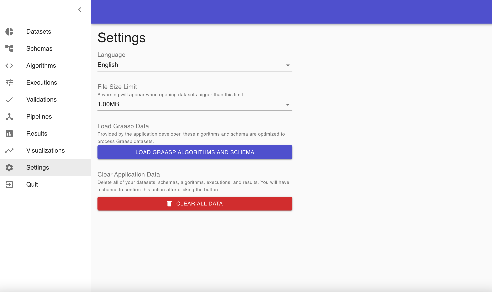

<h1 align="center">Graasp Insights</h1>

  A Cross-Platform Desktop Client for Dataset Anonymization

## About Graasp Insights

Graasp Insights is an open-source desktop client for dataset anonymization built with [Electron.js](https://github.com/electron/electron). After loading a dataset into the application, a user can run anonymization scripts on the dataset, selecting from scripts built into the application, or writing their own scripts (in Python) via an in-app editor. The application runs completely on a user's local device, and its code is open-source and freely available ([GitHub repository](https://github.com/graasp/graasp-insights)). It has initially been optimized to work on datasets generated by the [Graasp educational platform](https://graasp.eu).

See the [Graasp Insights user guide](./docs/graasp-insights-user-guide.md) for guidance on how to use the application.

For more information on the application, please visit the [Graasp Insights landing page](https://insights.graasp.org).

### Distributions

You can get the latest official distribution from our [GitHub release channel](https://github.com/graasp/graasp-insights/releases) or the [Graasp Insights landing page](https://insights.graasp.org).

### Legal Disclaimer

Graasp Insights (the 'software') and its source code are freely distributed under the GNU Affero General Public License (AGPLv3). The software and source code are provided to you “as is”, without warranty of any kind, express or implied. Without limiting the generality of the foregoing, the Graasp Association and École Polytechnique Fédérale de Lausanne (EPFL) make no representation or warranty regarding the functionality, reliability, or performance of the software, or the results to be obtained through the use of the software, or that the operation of the software shall be error-free. In no event shall the Graasp Association or EPFL be liable to you or any third party for any damages arising from the use of Graasp Insights, including but not limited to the distribution, misuse, leakage, or theft of any original files or datasets or duplicates thereof handled, processed, or generated by the software.

## Installation

### Pre-requirements

Graasp Insights uses your native installation of Python to run vairous algorithms. Therefore, make sure Python 2.x or higher is installed on your machine.

### Setting Up

Visit the [official website](https://insights.graasp.org/) and download the executable file corresponding to your operating system. Run it, read carefully the license and wait for the installation to finish.

> Note: Windows executable might throw an error during the installation. This might not be critical and Graasp Insights might have been correctly installed nevertheless.

When opening Graasp Insights, you are greeted with the `Datasets` tab.
Use the top-left menu button  to navigate to each distinct tab.

### Before You Begin

At first boot, the application is empty. You can start adding your own data in the different sections, but Graasp also provide  algorithms and schema specifically designed to work with datasets generated on the Graasp platform. In order to load them, navigate to the `Settings` tab.

In this tab you have various options:

- `Language`: Change the application's language. You can choose between `English` and `French`. Feel free to contact us if you want to translate the application into your language!
- `File Size Limit`: This option prevents you to open datasets bigger than the set limit. This is particularly useful to avoid the application to hang several minutes. To disable this feature, you can set this setting to the highest value possible.
- `Load Graasp Data`: This button loads in the application Graasp algorithms and schema. We recommand you to load these data to ease your analysis process with Graasp datasets.
- `Clear Application Data`: Clicking on this button will erase all data imported and created in the application: datasets, algorithms, schemas, pipelines, results, etc. This does not erase data you saved besides the application!

<!-- todo: create a list of the available algorithms for graasp -->

## User Guide

- [Datasets](datasets.md)
  - [Importing a dataset](datasets.md#Importing-a-dataset)
  - [Dataset management](datasets.md#Dataset-management)
  - [Results](datasets.md#Results)
- [Schemas](schemas.md)
- [Algorithms](algorithms.md)
  - [Adding an algorithm](algorithms.md#Adding-an-algorithm)
  - [Edit algorithm](algorithms.md#Edit-algorithm)
  - [Adding parameters](algorithms.md#Adding-parameters)
  - [Utils files](algorithms.md#Utils-files)
- [Executions](executions.md)
- [Validation](validation.md)
