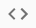
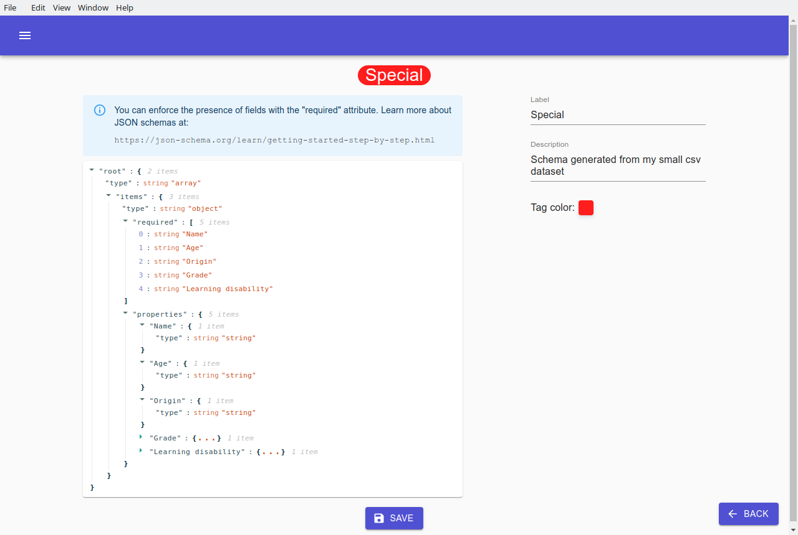

# Schemas

A schema describes the content structure of a dataset. The datasets loaded in Graasp Insights will have a schema tag attached to it if it satisfies the schema definition. A dataset can satisfy multiple schemas at the same time.

Some generic algorithms depend on the input dataset schema, therefore if a dataset doesn't follow any schema, it is advised to (automatically) generate one through the `Schemas` tab.

If you loaded the provided Graasp data, your `Schemas`tab should contain the `Graasp` schema.

## Add a new schema

To create a new schema, navigate to the `Schemas` tab to see every schema that is defined in Graasp Insights. Click on the lower right plus button  to generate a new schema. Enter a label, a description, a dataset to generate the schema from and a color for the schema tag. When done, click on `ADD SCHEMA`. If no dataset is selected, then the generated schema will be empty and you can define it manually (more details in the next section).

Schemas Tab             |  Add a Schema Dialog
:-------------------------:|:-------------------------:
  |  

## View a schema

Click on the `View Schema` button  to inspect a generated schema.

The schema definition on the left, the label, the description and the tag color can all be modified within this page. A sensible attribute to investigate is the `"required"` attribute which dictates which fields are required for the dataset to be considered valid. Click [here](https://json-schema.org/learn/getting-started-step-by-step.html) to learn more about `JSON` schemas.

Do not forget to `SAVE` your modifications before leaving the page.

