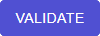

# Validations

Use the `Validations` tab to execute validation algorithms that test whether datasets have been correctly anonymized.

Click on the lower-right  to begin validation.

First select the dataset you want to validate. Then select an algorithm in the algorithm select menu and click on the squared plus button  next to it to add it to the set of algorithms that will be executed.

The added algorithms show up on the right. Expand them to see their description, edit parameters or remove them from the list.

Keep on adding validation algorithms and then click on the `VALIDATE` button  to execute them.

Back to the `Validations` tab, the validation now shows up in a table.

A status icon will be present next to each validation algorithm notifying you of the outcome of the validation algorithm. You can get further information about the outcome of a test by hovering over the corresponding status icon or clicking on the `View validation` icon next to it.

> Note: New validation algorithms can be added in the `Algorithms` tab. For more information about how to add an algorithm to Graasp Insights, jump to the [Adding an algorithm](#Adding-an-algorithm) section.
